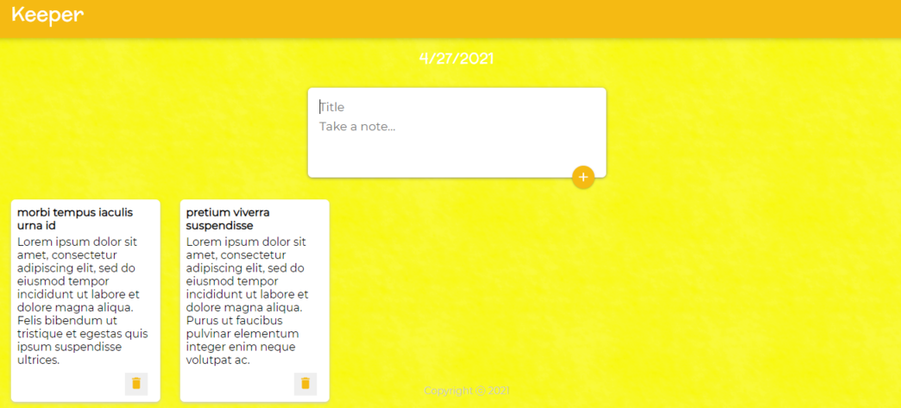

# **keeper-app**

## *About*
This web app was built for the purpose of storing notes or reminders throughout the day.

The front-end of this app was developed with React as part of a small project done for the purpose
  of becoming acquainted with the aforementioned -- React.
  
However, I've expanded the original project by adding a back-end (Express/Node.js), and also by adding 
  a database (MongoDB) so as to be able to save the notes.
  
 Since this project was developed with only a single user in mind (me), once I am done linking things up,
  I will work towards further expanding this project so that other users can come into the application,
  register an account, and store their own seperate notes. For as the architecture currently stands,
  everyone would be saving their notes in the same space. Thus, everyone can see eachothers notes, delete
  them, etc...
  
  

